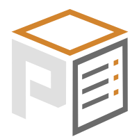
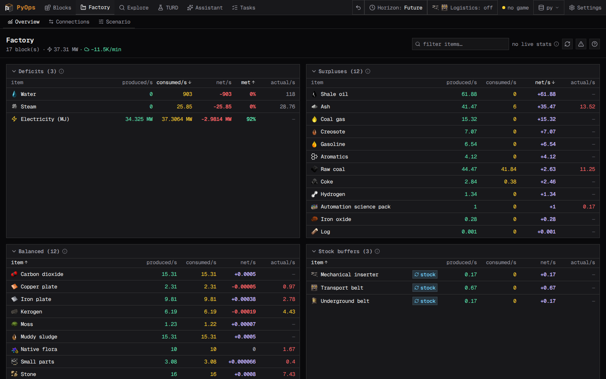
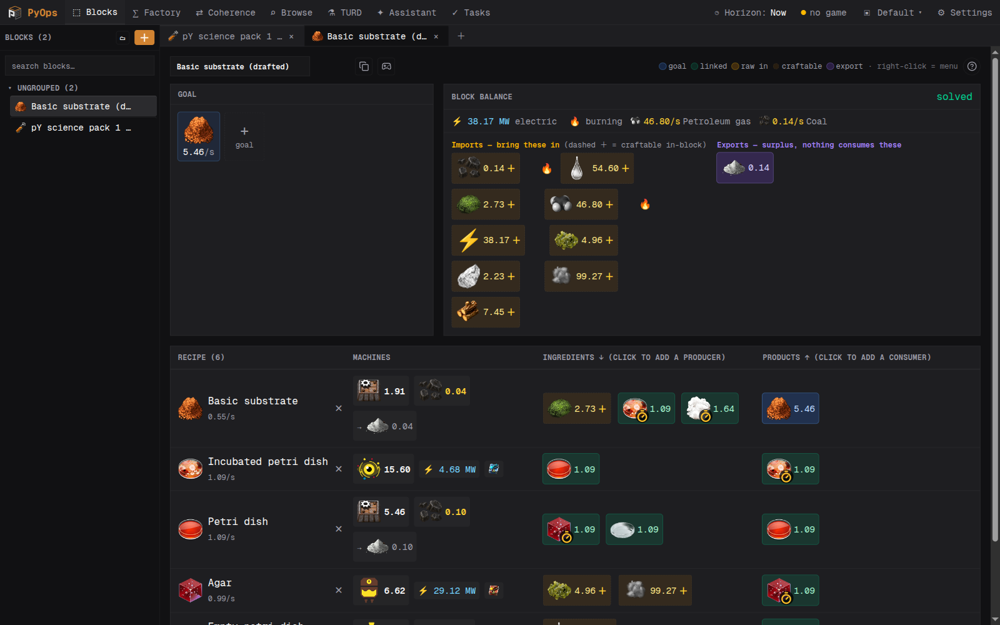
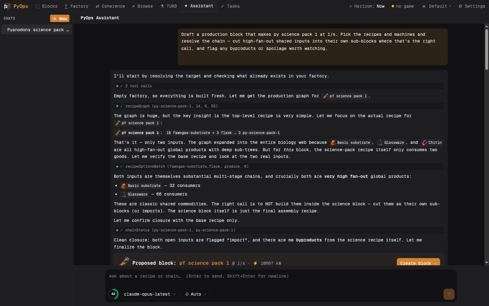
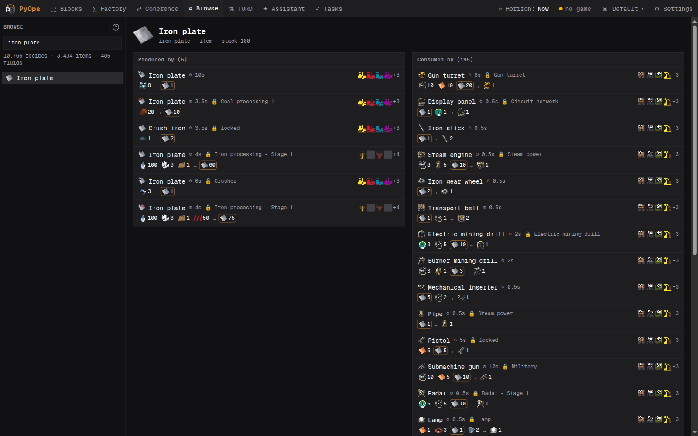

# PyOps



A web-based factory planner and in-game ops assistant for **Factorio**, built for
the **Pyanodons (Py)** overhaul — like [YAFC](https://github.com/Yafc-CE/yafc-ce),
but in the browser, simpler, with deep in-game integration and an AI-assisted
planner that actually understands Py's tangled recipe graph.

**Just want to run it?** PyOps ships as a **cross-platform desktop app** — Linux,
macOS, and Windows — that bundles its own runtime and self-updates, so it needs no
toolchain. [**Download the latest release ↓**](#desktop-app) — or [run it from
source](#setup) to hack on it.

---

## What it does

- **Design production blocks.** Pick one or more output goals (each with its own
  target rate), choose the recipes and machines, set modules/beacons, and PyOps
  solves the run-rates and building counts for the whole chain — including Py's cyclic recipe loops, fluid
  temperatures, and fractional machine counts. A goal with no recipe behind it (an
  unfinished block, or a producer lost to a data update) is flagged on the goal and
  tinted on the block's tab and sidebar entry instead of breaking the whole solve.
- **Balance the whole factory.** Every block's boundary flows (imports/exports)
  roll up into a factory-wide ledger so you can see deficits, surpluses, and how a
  change in one block ripples through the rest ("what-if").
- **See what it costs to build.** Beyond the per-second flows, each block tracks its
  one-time **build cost** — the materials needed to construct its buildings, in the
  block's **Building summary** drawer — so something like steel shows up even when no
  recipe in the chain consumes it.
- **Size your logistics.** A toggle (the **Logistics** header control) shows, per
  row, how many **belts** carry each item and how many **inserters or loaders**
  feed one building at the planned rate — sized against your current research
  (belt/inserter stacking follows the Horizon), with the belt/inserter tier and a
  stacking override picked globally. A quick feasibility check for whether a build
  is even possible with inserters or wants loaders. An optional toggle adds rocket
  **launches/min** per good (`floor(rocket_lift_weight / item weight)` per rocket).
- **Browse the data.** A searchable catalogue of every item, fluid, and recipe in
  your exact mod set — used-in / produced-by, ingredients, products, machines.
- **Track TURD choices.** Py's "There's Usually a Recipe Difference" tech upgrades
  are first-class: each master shows every branch — its description, the recipes it
  swaps or newly unlocks, and a hover diff of what actually changes (inputs,
  outputs, and base throughput per second). Pick a path and every block re-solves
  against it.
- **Plan with AI.** An assistant (via OpenRouter) drafts whole production chains
  and multi-block plans using tools over the recipe data, honouring what you can
  build _now_ vs. _after research_.
- **Keep tasks & notes.** A per-project planner: nested tasks (a markdown
  description, a checklist of steps, and child tasks for bigger breakdowns) that
  link to the recipes, items, fluids, research, and blocks they involve — plus a
  separate scratch-notes surface for quick calcs and reminders. Kept in the
  project's store, distinct from this repo's dev tracker.
- **Reach into the running game.** A companion Factorio mod links over localhost
  UDP: it shows a Helmod-style production-block panel in-game (with a toggle for
  per-good belts & inserters), locates
  producers/consumers via Factory Search, syncs your researched tech / TURD picks /
  placed machines back into the planner, lets you **quick-capture a task** while
  playing (with your location and selected entity as anchors), and can plan a
  Cybersyn request combinator for a station in-game. The assistant can also read
  the live factory through the bridge to ground its planning.
- **Jump anywhere from the keyboard.** **Ctrl+K** (Cmd+K on macOS) opens a command
  palette from any page — or press `/` when you're not typing in a field. Fuzzy
  search across pages and factory blocks, plus quick actions (new block, new
  project); arrows + Enter to run, Esc to close.
- **Use it on any screen.** The UI is responsive: the full desktop layout on a
  monitor, and on tablets, phones, and the Steam Deck the global nav and the
  block/browse/assistant/tasks sidebars collapse into drawers, dense tables reflow
  into readable cards, and reordering works by touch.

PyOps runs locally on your own machine, alongside your Factorio install — it reads
the recipe data straight from the game and (optionally) talks to a running session.

---

## Desktop app

The easiest way to run PyOps is the self-contained **desktop app** — a
[Tauri](https://tauri.app) window around the same server, bundling its own Node
runtime so it needs no toolchain. It runs on **Linux, macOS, and Windows**, and
**checks for updates on launch** (self-updating in place). Grab the build for your OS
from the [Releases](https://github.com/ApocDev/pyops/releases) page:

- **Linux** — `.AppImage` (`chmod +x` it and run; self-updates) or `.deb`
- **macOS** — `.dmg`
- **Windows** — the `-setup.exe` installer

It still needs **Factorio** installed locally to read your recipe data via a data
sync — PyOps is built for the **Py** mods (and Py-specific views like TURD only
appear when that data is present), but it'll load whatever mod set you sync. A fresh
install starts empty — open **⚙ Settings › Game data** and run a sync on first
launch, same as [from source](#setup) below. For how it's built and released, see
[`docs/desktop.md`](docs/desktop.md).

---

## Screenshots

The **Factory** view rolls every block's imports/exports into one ledger — deficits,
surpluses, stock buffers, and a machine count compared against what you've actually
placed in-game. Every section sorts by any column (click a header; the choice sticks)
and collapses out of the way. Deficits rank by **% of demand met** rather than raw
rate, so a fully-starved intermediate outranks a half-fed bulk fluid no matter how
small its numbers are.



The **block editor** — pick one or more goals (each with its own target rate),
choose recipes / machines / modules, and the solver runs the rates and building
counts for the whole chain (cyclic recipes, fluid
temperatures, byproducts, fractional machines). New recipes default to the
lowest-tier building and cheapest fuel; star a building or fuel in its picker to make
it the **favorite** for that category, and new recipes there adopt it once it's
researched — existing blocks keep their picks. **Toggle a recipe off** to keep it in
the block but drop it from the solve — flip between two recipes for the same output to
compare them, or park future rows (T1 now, T2–T4 later) until you enable them. **Toggle
a whole block off** the same way: it stays in the sidebar (dimmed) and still opens for
editing, but contributes nothing to the factory-wide totals until re-enabled. A block's
icon follows its first goal by default — click the icon next to the block's name to
pick any item or fluid instead (with a one-click reset back to auto). Long chains fold
into **sub-blocks**: right-click a recipe's name to start a named group, add rows to it,
and collapse it to a single line showing the chain's net flows (inputs → outputs,
intermediates cancelled), machines and power. Purely visual — the solve is unchanged.

Deliberate-spoilage steps (the uranium chain's decay, nagesium and friends) show their
**storage buffer** right on the row: how many items sit mid-spoil at the solved
throughput (`rate × spoil time`) and roughly how many stacks that is — the "how many
chests do I need while it decays" figure. For *incidental* spoilage — stuff rotting
because it isn't consumed fast enough — a spoilable **surplus** gets a "rots in X"
flag, and any spoilable can carry a **planned spoil loss** (right-click → Plan spoil
loss): an expected rot rate the solver covers with extra production, shown in an
amber strip on the block balance.

Each block also reports its **power and pollution budget** — electric draw and
pollution/min (machine base emissions × energy-consumption × pollution-module
effects) — with factory-wide totals in the Factory header.


Numbers everywhere scale their precision to the value: a `0.001/s` trickle block shows
its real rates instead of a wall of rounded-down `0.00`, and only a true zero reads as
`0`. Large figures render compact (`200K`) by default — switch to full (`200,000`) with
the **Compact large numbers** toggle under **⚙ Settings › Planning › Display**. Goal
rates aren't chained to per-second either: click a goal's unit to cycle `/s → /min →
/h` and enter science as `10/min` or a slow bootstrap as `0.5/h` — the unit sticks per
goal, while the solver keeps working in per-second underneath.

Not everything is a throughput target. Right-click a goal and choose **Keep in stock**
to turn it into a buffer goal — "keep 100 on hand" — with a refill window (default
10 min, click to cycle): the machines are sized to rebuild the buffer within the
window instead of chasing a made-up trickle rate. Stock production still counts in the
factory ledger, marked with a small **↻ stock** badge so refill demands read apart
from continuous throughput.



The **AI assistant** drafts a whole block from a goal: it resolves the chain, cuts
shared high-fan-out inputs into their own sub-blocks, and flags byproducts, spoilage,
and TURD upgrades.



**Browse** — a searchable catalogue of every item, fluid, and recipe in your exact mod
set, with produced-by / used-in (here: Iron plate — 14 producers, 160 consumers).



---

## Requirements

_To run from source (below). The desktop app needs none of this._

- **Node.js** (current LTS) and **pnpm** — the app's toolchain ([Vite+](https://viteplus.dev/),
  the `vp` CLI) handles the rest.
- **Factorio 2.0** installed locally, with the **Pyanodons** mod suite and
  **pypostprocessing** — PyOps reads your recipe data by running the game's data
  dump.
- _Optional, for the in-game features:_ the PyOps companion mod (in [`mod/`](mod/))
  and the [Factory Search](https://mods.factorio.com/mod/FactorySearch) mod.
- _Optional, for the AI assistant:_ an [OpenRouter](https://openrouter.ai) API key.
- _Optional, for external MCP clients:_ Codex and Claude Code can use the project
  MCP configs in this repo once the app is running on `http://localhost:3000`.

---

## Setup

```bash
cd app
vp install        # install dependencies
vp dev            # start PyOps at http://localhost:3000
```

The dev server also exposes the PyOps MCP tool surface at
`http://localhost:3000/mcp`. The repo includes project-scoped config for Codex
(`.codex/config.toml`) and Claude Code (`.mcp.json`) pointing at that endpoint;
Claude Code asks for one-time approval of project MCP servers on first use.

Then open PyOps, go to **⚙ Settings › Game data**, and run a sync. PyOps launches
your Factorio install headlessly, reads its recipe data, and loads it into a local
database. The first sync takes ~1–2 minutes (longer if you include icons). The same
tab records and lists the mods (with versions) your data was dumped from, so you can
see exactly what your saved plans were built against.

If your Factorio isn't installed at the default Steam location, point PyOps at it
with the `FACTORIO_BIN` / `FACTORIO_DATA_DIR` settings below.

### Reaching the dev server remotely (optional)

To open PyOps from your phone or another machine, expose the running dev server
through a tunnel with [`scripts/tunnel-dev`](scripts/tunnel-dev):

```bash
scripts/tunnel-dev               # auto-pick cloudflared / ngrok / tailscale
scripts/tunnel-dev tailscale     # force a provider
scripts/tunnel-dev down          # tear tunnels back down
```

It exposes `:3000` (override with `--port` / `$PYOPS_DEV_PORT`); run `vp dev`
first. See `scripts/tunnel-dev --help` for custom hostnames (a cloudflared named
tunnel via `--name`, an ngrok reserved domain via `--domain`; tailscale Funnel
always serves on the node's own MagicDNS name). The dev server already allows the
providers' domains; for your own custom domain add it to `PYOPS_ALLOWED_HOSTS`
(comma-separated, or `true` to allow any host).

### Using the in-game features

The companion mod ([`mod/`](mod/)) links the planner to a running game over
localhost.

**1. Put the mod in your Factorio mods folder.** The easiest way is the
**Companion mod** card under **⚙ Settings › In-game link** — it detects your OS and
installs the mod into your Factorio mods folder for you, either as a symlink
(recommended — it tracks the repo, so pulling updates the mod) or a plain copy. On
Windows the "symlink" is a directory junction, so it needs no admin or Developer
Mode.

To do it by hand instead, link or copy `mod/` into your mods folder as a folder
named `pyops`, from the repo root:

_Linux_

```bash
ln -s "$PWD/mod" ~/.factorio/mods/pyops
```

_macOS_

```bash
ln -s "$PWD/mod" ~/"Library/Application Support/factorio/mods/pyops"
```

_Windows (PowerShell, from the repo root)_

```powershell
# directory junction — no admin needed (what the in-app button uses):
New-Item -ItemType Junction -Path "$env:APPDATA\Factorio\mods\pyops" -Target "$PWD\mod"
```

Or just copy the `mod` folder into the mods folder and rename the copy to `pyops`
(you'll need to re-copy after updates).

**2. Launch Factorio.** Easiest: hit **Launch Factorio** in PyOps' **Live bridge**
card — it starts the game with `--enable-lua-udp` already set to a free port. For a
Steam copy it launches through Steam (so cloud saves, overlay, and achievements keep
working), falling back to a direct launch only if Steam isn't reachable. To start
the game yourself, add `--enable-lua-udp 37658` (Steam: right-click PyOps' game →
Properties → Launch Options). That port is the socket Factorio **binds for itself**,
so it must be a _different_ free port than the app's bridge port (`37657`) — the two
can't share one loopback UDP port, or Factorio fails to open its socket with
"Address already in use". Leave the mod's **PyOps bridge UDP port** at the app's
port (`37657`).

With PyOps running, the in-game panel connects automatically — there's no bridge
toggle to flip. From there you get the production-block view, in-world locate, and
live sync of your research, TURD picks, and placed machines back into the planner.

---

## Configuration

Set these in `app/.env.local` (or the environment). All are optional.

| Setting              | Default                                            | Purpose                                                                                               |
| -------------------- | -------------------------------------------------- | ----------------------------------------------------------------------------------------------------- |
| `FACTORIO_BIN`       | `~/.local/share/Steam/.../bin/x64/factorio`        | Path to the Factorio executable used for data syncs.                                                  |
| `FACTORIO_DATA_DIR`  | `~/.factorio`                                      | Factorio user data (mods, `script-output`).                                                           |
| `OPENROUTER_API_KEY` | —                                                  | AI **Assistant** key. Optional — set it here _or_ in **Settings → Assistant** (env wins).             |
| `PYOPS_AGENT_MODEL`  | `~anthropic/claude-sonnet-latest`                  | Any OpenRouter model id. Optional — set it here, per chat, or in **Settings → Assistant** (env wins). |
| `PYOPS_BRIDGE_PORT`  | `37657`                                            | UDP port the app's bridge listens on (mod's send target). Use a _different_ port for `--enable-lua-udp`. |
| `DATABASE_URL`       | active project's file (else `projects/default.db`) | Override the local SQLite file.                                                                       |

---

## Documentation

How PyOps works under the hood lives in [`docs/`](docs/):

- [Architecture](docs/architecture.md) — the one-app-plus-mod model and repo layout.
- [Data pipeline](docs/data-pipeline.md) — how the Factorio data sync works.
- [Block solver](docs/solver.md) — the planning math.
- [Factorio bridge](docs/bridge.md) — the in-game link.
- [AI assistant](docs/ai-assistant.md) — the planning agent.

### Developing locally

PyOps uses [Vite+](https://viteplus.dev/) (the `vp` CLI) as its toolchain. From
inside [`app/`](app/):

```bash
vp install        # install dependencies (after pulling)
vp dev            # dev server at http://localhost:3000
vp check          # format + lint + typecheck — keep this clean
vp test           # run the Vitest suite
```

The end state of any change should be a clean `vp check`. The Factorio mod
([`mod/`](mod/)) is pure Lua with no build step — edit in place and reload the game
to test. For developer/agent visual checks, the MCP toolset includes
`gameScreenshot` and, once the currently loaded mod has the dev command,
`gameReloadMods` to invoke Factorio's mod reload over the bridge instead of using
desktop click automation. See [`AGENTS.md`](AGENTS.md) for the full toolchain commands and
conventions (commit style, the database commands, and the project layout).

---

## Credits & inspiration

- **[YAFC](https://github.com/Yafc-CE/yafc-ce)** — the planner model,
  the cost-analysis approach, and the overall "design blocks, balance the factory"
  shape.
- **[Helmod](https://mods.factorio.com/mod/helmod)** — the in-game production-block
  panel is heavily inspired by, if not close to ripped from, Helmod's
  production-block view. No Helmod assets are bundled; colored cells use Factorio's
  built-in `blue_slot`/`yellow_slot` styles.
- **[Factory Search](https://mods.factorio.com/mod/FactorySearch)** — the
  "locate in game" feature relays to Factory Search's remote interface rather than
  reimplementing producer/consumer/storage search.
- **[pypostprocessing](https://mods.factorio.com/mod/pypostprocessing)** — its
  planner/YAFC integration is what makes a clean, planner-friendly data dump
  possible.

---

## License

PyOps is free software, licensed under the **GNU General Public License v3.0** —
see [`LICENSE`](LICENSE) for the full text.

Copyright (C) 2026 ApocDev.

In short: you're free to use, study, modify, and share PyOps, including
commercially — but any distributed version (and any derivative built on it) must
stay open under the same GPLv3 terms. It can't be taken closed-source. This
matches the lineage of the tools that inspired it ([YAFC](https://github.com/Yafc-CE/yafc-ce)
and [Helmod](https://mods.factorio.com/mod/helmod) are GPLv3 as well).

Contributions are accepted under the same GPLv3 license.
